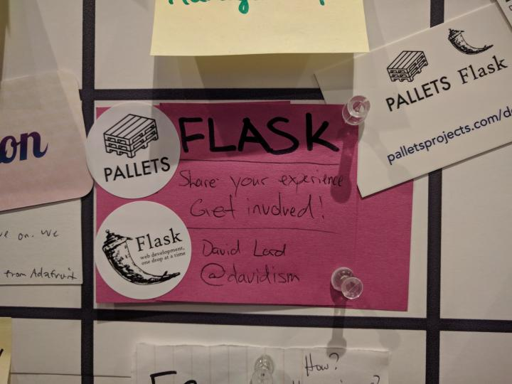
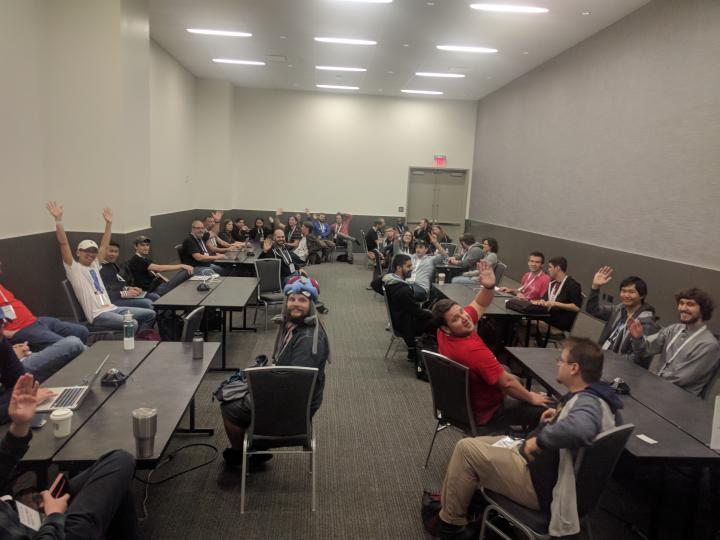
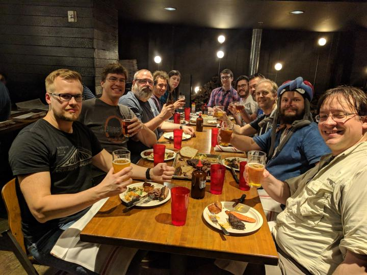

~~~~toml
title = "PyCon and Adding Maintainers to Click"
author_name = "David Lord"
published = 2018-06-01
tags = ["meta"]
~~~~

In May I attended PyCon US 2018 in Cleveland, Ohio. It's a great opportunity to meet people interested in the Pallets projects and Python web applications. It can be a little intimidating, but also a lot of fun. The biggest difficulty is that there are *too many* things to do, and I always wish everyone could have a few more days together.

During the main conference, while talks are happening, anyone can organize "open spaces," impromptu meetings for any topic. I organized a Pallets open space, and we had a huge turnout. I was kind of unprepared for the size, so we started with people asking me questions, and then split up into tables for new users, Flask, Click, and Jinja.

For up to four days after the talks, developers get together for sprints, working together to contribute to Python open source projects. Experienced developers help new ones learn how to contribute, and everyone gets to learn about new projects and meet the developers behind them.

At the open space, I had mentioned that no one had really been maintaining Click for the past year. It turns out a *lot* of people use Click. They came motivated from the open space to contribute during the sprint. Some were new to contributing, but they all had one thing in common: they knew how Click was being used more than I did! So I took a chance and gave them all write permissions to the repository. Click started at ~250 open issues and 68 pull requests. After 2 days, it was at 140 issues and 22 pull requests. Wow! With that success, I'm officially welcoming all these new maintainers to the Pallets Click team. While Click stole the show, we had great contributions to Werkzeug, Flask, and Jinja as well.

If you want to get involved, a great way is to [watch our repositories on GitHub](https://help.github.com/articles/watching-and-unwatching-repositories/). You'll get notifications for each issue, so you can see what's happening and start contributing. You can help by triaging issues, improving tests and documentation, and fixing bugs. If your company uses a Pallets project like Flask, Click, or Jinja, consider pointing them to our [PSF donation page](https://www.palletsprojects.com/donate). Donations will help get maintainers to more events so we can do more sprints like this one. Thank you to everyone at PyCon and in the community for making Pallets a success!
